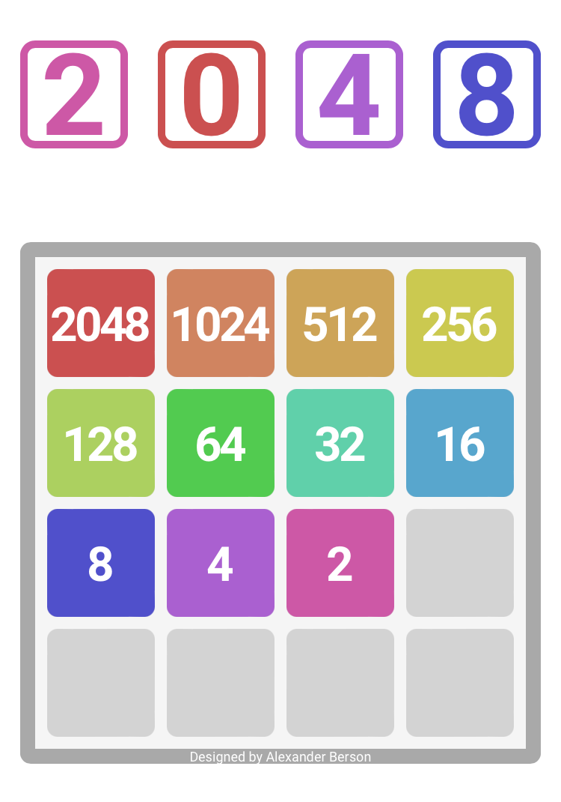

# 2048

Pair matching tiles together to create the 2048 tile.  
You can [play 2048 online](https://alex-berson.github.io/2048/) or  

You can also watch [an AI playing 2048](https://alex-berson.github.io/2048/index.html?mode=ai) (duration: approx. 8 mins).

## Description

**2048** is a single-player sliding tile puzzle game played on a plain 4×4 grid, with numbered tiles that slide when a player moves them using the four arrow keys or swipe gestures on a touchscreen device. Every turn, a new tile randomly appears in an empty spot on the board with a value of either 2 or 4. Tiles slide as far as possible in the chosen direction until they are stopped by either another tile or the edge of the grid. If two tiles of the same number collide while moving, they will merge into a tile with the total value of the two tiles that collided. The resulting tile cannot merge with another tile again in the same move. 

If a move causes three consecutive tiles of the same value to slide together, only the two tiles farthest along the direction of motion will combine. If all four spaces in a row or column are filled with tiles of the same value, a move parallel to that row/column will combine the first two and last two. 

The game is won when a tile with a value of 2048 appears on the board. When the player has no legal moves (there are no empty spaces and no adjacent tiles with the same value), the game ends.

## Screenshot

  

## License

Copyright &copy; 2022 Alexander Berson. This project is licensed under the [MIT license](LICENSE.txt "MIT License").

